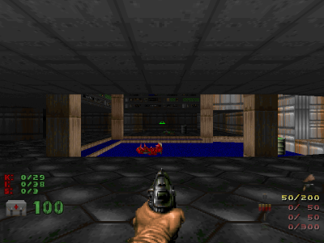
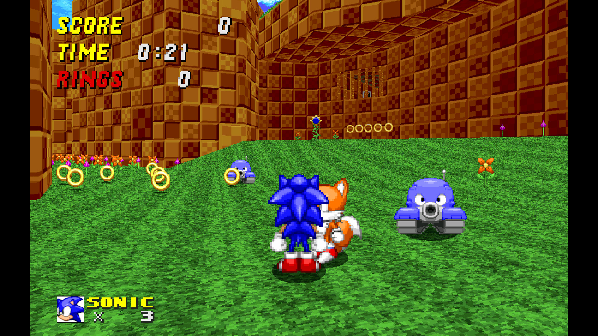
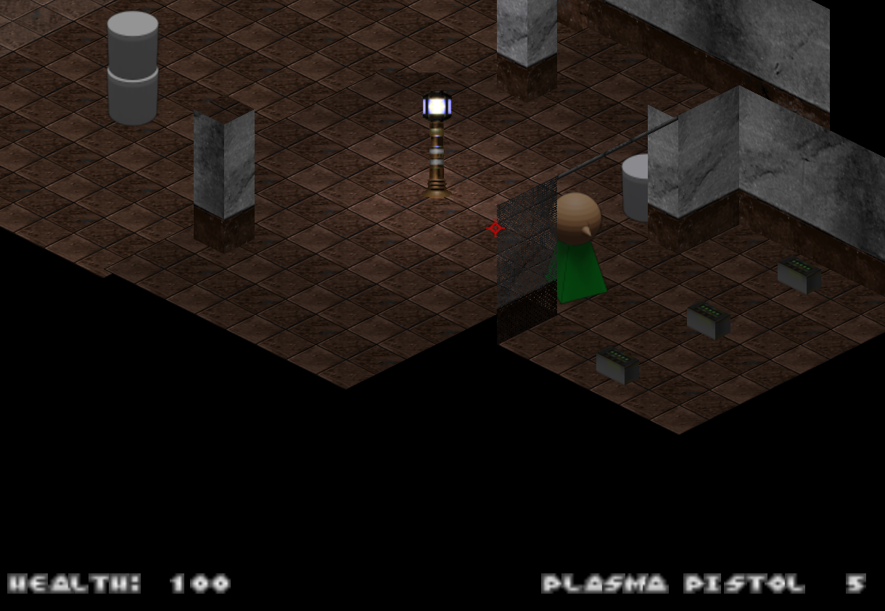

# Plantilla Isométrica para GZDoom

## Índice

* [1. Preámbulo](#1-preámbulo)
* [2. Resumen del proyecto](#2-resumen-del-proyecto)
* [3. Consideraciones generales](#3-consideraciones-generales)
* [4. Hitos sugeridos](#4-hitos-sugeridos)
* [5. Consideraciones técnicas](#5-consideraciones-técnicas)
* [6. Objetivos de aprendizaje](#6-objetivos-de-aprendizaje)
* [7. Pistas, tips y lecturas complementarias](#7-pistas-tips-y-lecturas-complementarias)

***


Doom original


Sonic Robo Blast 2

## 1. Preámbulo

Doom, lanzado en 1993, marcó un antes y un después en la historia de los videojuegos por su motor flexible y su activa comunidad de creación de mods. GZDoom es una versión moderna y ampliada de este motor, que permite crear juegos con gráficos avanzados, scripts personalizados y soporte para modelos 3D y sprites 2D.

Esta plantilla utiliza una **vista isométrica 2.5D**, donde el mundo se observa desde una perspectiva elevada y angular. Esto facilita la exploración, la interacción con personajes y objetos, y permite crear experiencias visuales únicas, tanto con sprites como con modelos 3D.

## 2. Resumen del proyecto

Este repositorio es una base para crear tu propio juego isométrico en GZDoom. No está limitado a disparos o combate: puedes desarrollar dinámicas como exploración, conversación con NPCs, resolución de acertijos, vuelo, o cualquier mecánica que imagines. El sistema es flexible y permite comenzar con sprites 2D, con la opción de incorporar modelos 3D más adelante.



El personaje principal podrá explorar el mundo y realizar acciones según la mecánica que definas. El inventario será visible en el HUD y podrás incluir NPCs, objetos y decoraciones según tu visión.

## 3. Consideraciones generales

* El rango de tiempo estimado para completar el proyecto es de 1 a 3 Sprints.
* Enfócate en aprender y experimentar, no solo en "completar" el proyecto.
* No necesitas saberlo todo antes de empezar. Aprende mientras avanzas.

## 4. Hitos sugeridos

1. **Preparar el entorno de desarrollo**
   - Clona el repositorio y explora la estructura.
   - Instala GZDoom, VSCode, SLADE, Blender y Krita.

2. **Reemplazar el sprite/modelo del jugador**
   - Cambia el asset del personaje principal por uno propio.

3. **Colocar modelos 3D estáticos en los mapas** (opcional)
   - Añade decoraciones y objetos usando modelos 3D.

4. **Implementar puertas y objetos interactivos**
   - Crea puertas, cofres, NPCs u otros elementos con los que el jugador pueda interactuar.

5. **Prototipar inventario y pickups** (Hacker edition)
   - Crea un sistema básico para recoger y mostrar objetos en el HUD.

## 5. Consideraciones técnicas

- El desarrollo se realiza principalmente con sprites 2D, pero puedes experimentar con modelos 3D.
- Para trabajar en el proyecto:
  1. Abre una terminal y clona el repositorio:
     ```sh
     git clone https://github.com/icarito/isometric-standalone-game-guide.git
     cd isometric-standalone-game-guide
     ```
  2. Abre la carpeta en VSCode:
     ```sh
     code .
     ```
  3. Para compilar el proyecto y generar el archivo `.ipk3`:
     ```sh
     make
     ```
  4. Para ejecutar el juego con GZDoom, usa:
     ```sh
     cd build/
     gzdoom -iwad gzdoom_isometric_mousectrl.ipk3
     ```

- Explora y edita los archivos usando SLADE, Blender y Krita según lo que quieras modificar o crear.

## 7. Pistas, tips y lecturas complementarias

- [Descargar VSCode](https://code.visualstudio.com/)
- [Descargar SLADE 3](https://slade.mancubus.net/)
- [Descargar Blender](https://www.blender.org/download/)
- [Descargar Krita](https://krita.org/es/download/)
- [GZDoom Wiki](https://zdoom.org/wiki/Main_Page)
- [ZScript](https://zdoom.org/wiki/ZScript)
- [GZDoom Modding 101](https://dileepvr.github.io/gzdoom_modding_101/)

***

¿Listo para comenzar? Explora, experimenta y crea tu propia aventura isométrica.
